# 🎮 TOSBA - Application Flow Diagrams

> **Comprehensive Visualization**: Detailed Mermaid diagrams explaining all workflows of the TOSBA application.

## 📋 Table of Contents

1. [General Application Flow](#1-general-application-flow)
2. [Onboarding Process](#2-onboarding-process)
3. [Buddy Creation](#3-buddy-creation)
4. [Assessment System](#4-assessment-system)
5. [Curriculum Generation](#5-curriculum-generation)
6. [Game System](#6-game-system)
7. [Magic Homework Converter](#7-magic-homework-converter)
8. [AR-Lite Home Gallery](#8-ar-lite-home-gallery)
9. [AI Services](#9-ai-services)
10. [Data Flow](#10-data-flow)

---

## 1. GENERAL APPLICATION FLOW

Top-level flow showing all major components of the application.

---

## 2. ONBOARDING PROCESS

Initial user registration and profile creation process.

---

## 3. BUDDY CREATION

🌟 **Revolutionary**: Transforming a child's own toy into a living digital friend.

---

## 4. ASSESSMENT SYSTEM

Static testing system to determine child's level.

---

## 5. CURRICULUM GENERATION

7-day personalized curriculum creation and parallel content generation.

---

## 6. GAME SYSTEM

Game session management and adaptive difficulty.

```mermaid
graph TD
    Start[Start Game] --> LoadPack[useGamePackLoader<br/>Load Module]
    
    LoadPack --> Cache{In Cache?}
    
    Cache -->|Yes| LoadFromCache[Load from Cache<br/>Fast]
    Cache -->|No| Generate[Generate Content<br/>Slow]
    
    Generate --> LoadFromCache
    
    LoadFromCache --> Session[useGameSession<br/>Start Session]
    
    Session --> Template{Select<br/>Game Template}
    
    Template --> DragDrop[DragDropTemplate]
    Template --> TapTrack[TapTrackTemplate]
    Template --> Choice[ChoiceTemplate]
    Template --> Speaking[SpeakingTemplate]
    Template --> TileReveal[TileRevealTemplate]
    Template --> Feeding[FeedingTemplate]
    Template --> Story[StoryBookPlayer]
    
    DragDrop --> BuddyWidget[Buddy Widget<br/>Live Support]
    TapTrack --> BuddyWidget
    Choice --> BuddyWidget
    Speaking --> BuddyWidget
    TileReveal --> BuddyWidget
    Feeding --> BuddyWidget
    Story --> BuddyWidget
    
    BuddyWidget --> Question[Present Question]
    
    Question --> Answer{Answer}
    
    Answer -->|Correct| Correct[✓ Correct!<br/>+1 Star]
    Answer -->|Wrong| Wrong[✗ Wrong<br/>Give Hint]
    
    Correct --> NextQ{"More<br/>Questions?"}
    Wrong --> Adaptive{Check Adaptive<br/>System}
    
    Adaptive -->|2+ Errors| Break[Offer Break]
    Adaptive -->|Continue| NextQ
    
    Break --> NextQ
    
    NextQ -->|Yes| Question
    NextQ -->|No 5/5| Complete[Session Complete<br/>Celeberation!]
    
    Complete --> SaveLog[Save Performance Log]
    SaveLog --> UpdateModule[Mark Module Complete]
    UpdateModule --> Dashboard[Return to Dashboard]
    
    style Start fill:#e1f5ff
    style BuddyWidget fill:#ffe1f5
    style Adaptive fill:#fff4e1
    style Complete fill:#e1ffe1
```

---

## 7. MAGIC HOMEWORK CONVERTER

🌟 **Revolutionary**: Automatically converting paper homework into interactive games.

---

## 8. AR-LITE HOME GALLERY

🌟 **Revolutionary**: Converting child's own home into game space and real world generalization.

```mermaid
graph TD
    Start[Start Home Gallery] --> Category{Select<br/>Category}
    
    Category --> Kitchen[🍳 KITCHEN]
    Category --> Bedroom[🛏️ BEDROOM]
    Category --> Family[👨‍👩‍👧 FAMILY]
    Category --> Other[📦 OTHER]
    
    Kitchen --> Upload[Upload Photo<br/>Wide Angle]
    Bedroom --> Upload
    Family --> Upload
    Other --> Upload
    
    Upload --> Vision[Gemini 3 Vision API<br/>Object Detection]
    
    Vision --> Detect[Detect Objects]
    
    Detect --> Objects[DetectedObjects Array]
    Objects --> Obj1[Apple<br/>Box: 100,200,150,250]
    Objects --> Obj2[Refrigerator<br/>Box: 50,100,400,300]
    Objects --> Obj3[Chair<br/>Box: 300,150,380,280]
    
    Obj1 --> SaveGallery[Save to Gallery<br/>UserPhoto]
    Obj2 --> SaveGallery
    Obj3 --> SaveGallery
    
    SaveGallery --> Options{Parent<br/>Option}
    
    Options -->|Test Play| CreateGame[Create Game<br/>TAP_TRACK]
    Options -->|Assign to Schedule| AddToSchedule[Add to Curriculum]
    
    CreateGame --> SelectTarget[Select Random Target<br/>e.g. Apple]
    SelectTarget --> BuildPayload[Build Game Payload]
    
    BuildPayload --> Background[Background: Real Photo]
    BuildPayload --> Instruction[Instruction: Find the Apple!]
    BuildPayload --> Items[Items: All Objects]
    BuildPayload --> Positions[Positions: Bounding Boxes]
    
    Background --> PlayGame[Play Game<br/>Game Arena]
    Instruction --> PlayGame
    Items --> PlayGame
    Positions --> PlayGame
    
    PlayGame --> Child[Child Experience]
    
    Child --> Recognize[Recognizes<br/>Own Kitchen]
    Recognize --> Search[Search for Apple]
    Search --> Click{Click}
    
    Click -->|Correct| Success[✓ Success!<br/>Buddy Celebrates]
    Click -->|Wrong| Hint[Give Hint<br/>Try Again]
    
    Hint --> Search
    
    Success --> Transfer[Generalization<br/>To Real World]
    Transfer --> RealWorld[Can Find Apple<br/>In Real Kitchen!]
    
    AddToSchedule --> Permanent[Permanent Module<br/>Visible on Dashboard]
    
    RealWorld --> Complete[Complete!]
    Permanent --> Complete
    
    Complete --> Dashboard[Return to Dashboard]
    
    style Start fill:#e1f5ff
    style Vision fill:#ffe1f5
    style Child fill:#fff4e1
    style Transfer fill:#e1ffe1
    style RealWorld fill:#d4edda
```

---

## 9. AI SERVICES

### 9.1 Judge Service Workflow

Quality assurance and safety check for all generated content.

### 9.2 Content Generation Pipeline

Content generation process for different game types.

### 9.3 Gemini 3 Live Service

Real-time voice interaction and context management.

---

## 10. DATA FLOW

### 10.1 State Management Architecture

Zustand store structure and data management.

### 10.2 IndexedDB Cache Strategy

Caching strategy and TTL management.

### 10.3 Performance Optimization

Parallel processing and optimization strategies.

