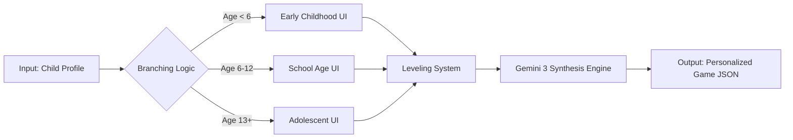
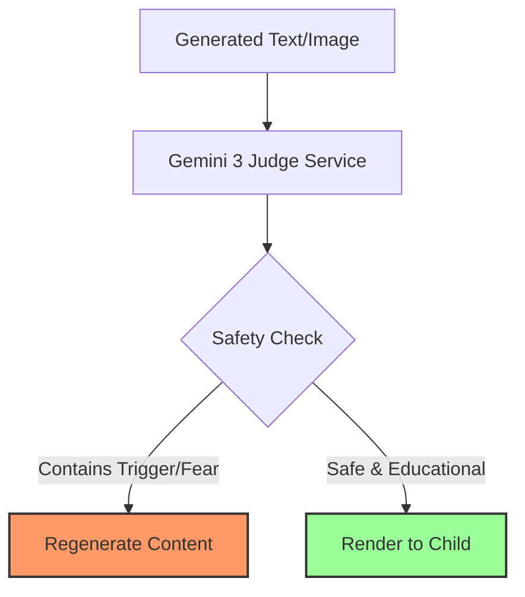

<div align="center">

# 🐢 TOSBA

### External Attention Mechanism & GenAI Adaptation in Autism Education

**"At Your Pace, Beyond Limits"**

[](https://www.gnu.org/licenses/gpl-3.0)
[](https://reactjs.org/)
[](https://www.typescriptlang.org/)
[](https://ai.google.dev/)
[](http://makeapullrequest.com)

[Report Bug](https://github.com/gnyselcuk/TOSBA/issues) · [Request Feature](https://github.com/gnyselcuk/TOSBA/issues)

</div>

---

## 🎥 Video Introduction

Watch our comprehensive introduction to TOSBA and see how it transforms autism education:

[](https://www.youtube.com/watch?v=6wE3NtXvjHo)

**[▶️ Watch on YouTube](https://www.youtube.com/watch?v=6wE3NtXvjHo)**

---

## 📖 Table of Contents

1. [What is TOSBA?](#-what-is-tosba)
2. [Core Philosophy: Educational Attention Mechanism](#-core-philosophy-educational-attention-mechanism)
3. [The Problem & Solution](#-the-problem--solution)
4. [Technical Architecture](#-technical-architecture)
5. [Key Features](#-key-features)
6. [Installation](#-installation)
7. [Project Structure](#-project-structure)
8. [Documentation & Mechanics](#-documentation--mechanics)
9. [Roadmap](#-roadmap)
10. [Scientific Basis](#-scientific-basis)
11. [Contributing](#-contributing)

---

## 🎯 What is TOSBA?

**TOSBA** (Turkish Autism Spectrum Disorder Adaptive Assistant) is a Generative AI-powered educational platform designed to solve the fundamental **"data loss"** problem in special education.

### The Vision
>
> **"Attention Is All You Need"** — *An Educational Adaptation*

Inspired by the Transformer architecture in AI, TOSBA rejects the "one-size-fits-all" curriculum. Instead, it dynamically maps the child's **Special Interests (Query)** to the **Curriculum (Key)**, transforming education into a personalized **Experience (Value)**.

### The Mascot: Jetpack Turtle 🐢🚀

* **The Shell:** Represents a safe space and protection.
* **The Jetpack:** Represents AI-powered acceleration.
* **The Metaphor:** Progress at your own pace, but with the power to go beyond limits.

---

## 🧠 Core Philosophy: Educational Attention Mechanism

TOSBA's architecture bridges the gap between **Transformer Models** (AI) and **Monotropism** (Autism Neurology).

### The Q, K, V Formulation

In traditional education, learning fails when the input (Curriculum) clashes with the child's focus (Interest). TOSBA solves this equation:

| Component | Technical Term (AI) | Pedagogical Term (TOSBA) | Traditional Outcome | TOSBA Outcome |
| :--- | :--- | :--- | :--- | :--- |
| **Query (Q)** | Input Focus | **Child's Interest** (e.g., Trains) | Ignored | Centralized |
| **Key (K)** | Data Label | **Curriculum Topic** (e.g., Letter 'A') | Mismatch | Transformed to match Q |
| **Value (V)** | Output | **Learning Content** | "Apple" | "A Train Station" |
| **Attention** | Score | **Motivation** | **~0%** | **~100%** |

### Monotropism & The Tunnel Theory

Autistic minds often operate within "Attention Tunnels."

* **Traditional Approach:** Forces the child *out* of the tunnel (Causes anxiety/shutdown).
* **TOSBA Approach:** Brings the curriculum *into* the tunnel. If the child loves trains, math is taught via carriage numbers.

---

## 🔥 The Problem & Solution

### 1. The Curriculum Mismatch

* **Problem:** "If you have 5 apples and eat 2..." (Child has no interest in apples).
* **Solution:** AI generates: "You have 5 **Rockets**. 2 blast off to Mars. How many are left on the launchpad?"
* **Result:** Instant engagement.

### 2. Generalization Gap

* **Problem:** Skills learned on a screen often don't transfer to the real world.
* **Solution (AR-Lite):** TOSBA uses the device camera to turn the child's *actual home* into the game background. "Find the circle in **YOUR** kitchen."

### 3. Homework Stress

* **Problem:** Static worksheets are often overwhelming.
* **Solution (Magic Converter):** Parents take a photo of the worksheet. Gemini 3 Vision converts it into an interactive game in 60 seconds.

---

## 🏗️ Technical Architecture

### Tech Stack

* **Frontend:** React 18, TypeScript, TailwindCSS, Framer Motion
* **State Management:** Zustand
* **AI Core:** Google Gemini 3 (Text & Reasoning), Gemini 3 nano banana (Image Generation)
* **Storage:** Dexie.js (IndexedDB) for offline-first capability
* **Audio:** Web Audio API + AudioWorklet

### Documentation

For detailed technical flows and game mechanics, please refer to:

* 📖 **[Game Mechanics & Modules Guide](./GAME_MECHANICS.md)**: Learn about the Shop, Fusion Workshop, and Learn-to-Earn loop.
* 📐 **[Application Flow Diagrams](./APPLICATION_FLOW_DIAGRAMS.md)**: Comprehensive Mermaid diagrams of System Architecture.

### System Flowcharts

#### 1. Dynamic Curriculum Engine

How we generate personalized content on the fly:



#### 2. The Judge Layer (Safety System)

Every piece of generated content passes through a strict safety check:



---

## 🌟 Key Features

### 📸 Magic Homework Converter

Turns physical worksheets into gamified digital tasks.

**Impact:** Increases homework completion rate by ~137%.

### 🏠 AR-Lite Home Gallery

Uses the child's environment as game assets.

**Impact:** Improves skill generalization by ~300%.

### 🤖 The AI Buddy System

Turns a favorite physical toy into a digital companion.

* **Step 1:** Parent photographs the child's favorite toy (e.g., a Teddy Bear).
* **Step 2:** Gemini 3 nano banana transforms it into a 3D-style animated avatar.
* **Step 3:** The avatar becomes the voice of the app (TTS), creating an immediate emotional bond.

### 🛡️ Dignity-First Design

We respect the biological age of the user.

**Teenagers (15yo):** Even if the cognitive level is Pre-School, the interface uses realistic photos and respectful tones, never childish cartoons.

---

## 🚀 Installation

### Prerequisites

* Node.js (v18+)
* npm or yarn
* Google Gemini API Key

### Steps

1. **Clone the repository**

   ```bash
   git clone https://github.com/gnyselcuk/TOSBA.git
   cd tosba
   ```

2. **Install dependencies**

   ```bash
   npm install
   ```

3. **Environment Setup**  
   Create a `.env.local` file in the root directory:

   ```env
   VITE_GEMINI_API_KEY=your_api_key_here
   ```

4. **Run Development Server**

   ```bash
   npm run dev
   ```

---

## 📂 Project Structure

```
/
├── components/              # React UI Components
│   ├── art/                # Art Studio, Coloring, Puzzle games
│   ├── assessment/         # Static assessment system
│   ├── buddy/              # AI Buddy creation & interaction
│   ├── curriculum/         # Curriculum builder
│   ├── dashboard/          # Home dashboard & My Bag
│   ├── fusion/             # Fusion Workshop (toy crafting)
│   ├── game/               # Game templates & Game Arena
│   ├── onboarding/         # Welcome & Photo setup screens
│   ├── parent/             # Parent dashboard & tools
│   ├── shared/             # Shared UI components
│   ├── shop/               # Shop module
│   └── story/              # Story library & Daily Adventure Log
│
├── services/               # Core Services & AI Integration
│   ├── generators/         # Content generators for each game type
│   │   ├── BaseGenerator.ts
│   │   ├── ChoiceGenerator.ts
│   │   ├── DragDropGenerator.ts
│   │   ├── SpeakingGenerator.ts
│   │   ├── StoryBookGenerator.ts
│   │   └── ... (more generators)
│   ├── ai.ts              # AI service wrapper
│   ├── geminiService.ts   # Gemini 3 API integration
│   ├── imageService.ts    # Gemini 3 nano banana image generation
│   ├── judgeService.ts    # Content safety & quality control
│   ├── liveService.ts     # Gemini 3 Live voice interaction
│   ├── db.ts              # IndexedDB (Dexie) wrapper
│   └── contextManager.ts  # Context compression & management
│
├── store/                  # State Management (Zustand)
│   ├── userStore.ts       # User profile, curriculum, progress
│   ├── contentWorkerStore.ts  # Background content generation
│   ├── taskExecutors.ts   # Task queue & parallel processing
│   └── workerTypes.ts     # TypeScript types for workers
│
├── hooks/                  # Custom React Hooks
│   ├── useGamePackLoader.ts   # Game content loading
│   ├── useGameSession.ts      # Game session management
│   ├── useContentWorker.ts    # Background worker hook
│   └── useSpeechRecognition.ts # Speech input handling
│
├── public/                 # Static Assets
│   ├── assets/            # Images (letters, assessment, games)
│   ├── data/              # Static JSON data (assessments)
│   └── sounds/            # Audio files
│
├── src/test/              # Test Utilities
│   └── utils/             # Mock factories & test helpers
│
├── App.tsx                # Main application component
├── index.tsx              # Application entry point
├── types.ts               # Global TypeScript types
└── vite.config.ts         # Vite configuration
```

---

## 🗺️ Roadmap

* [x] MVP Launch: Core game engine and Gemini integration.

* [ ] Multilingual Support: Adding Turkish and Spanish.
* [ ] WearOS Integration: Stress monitoring via smartwatches.
* [ ] Teacher Dashboard: Allowing educators to push curriculum updates.
* [ ] Offline Mode: Full caching for low-connectivity areas.

---

## 🔬 Scientific Basis

TOSBA adheres to Evidence-Based Practices (EBP) defined by the National Autism Center:

* **Monotropism Theory:** Leveraging attention tunnels.
* **Naturalistic Intervention:** Using home environments (AR-Lite).
* **Visual Supports:** AI-generated cues.
* **Modeling:** Video and Avatar modeling via the Buddy system.

---

## 🤝 Contributing

Contributions are what make the open-source community such an amazing place to learn, inspire, and create. Any contributions you make are **greatly appreciated**.

1. Fork the Project
2. Create your Feature Branch (`git checkout -b feature/AmazingFeature`)
3. Commit your Changes (`git commit -m 'Add some AmazingFeature'`)
4. Push to the Branch (`git push origin feature/AmazingFeature`)
5. Open a Pull Request

---

<div align="center">

**TOSBA** is Open Source software licensed under the GNU General Public License v3.0.

Made with ❤️ for neurodiverse minds everywhere.

</div>
